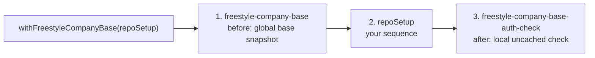

# @rigkit/fragments

Reusable workflow fragments for Rigkit configs.

The package currently exports `freestyleCompanyBaseFragment` and
`withFreestyleCompanyBase`, an opinionated global Freestyle base fragment and a
wrapper that runs a local GitHub auth check after repo-specific setup. The base
creates a Freestyle VM, installs common development tooling, initializes the
enabled interactive CLIs, snapshots the VM, and stores that snapshot in Rigkit's
global fragment cache. Repos can then build their project-specific setup on top
of the same base snapshot.

Installed by default:

- Git and common build packages
- GitHub CLI
- Node.js 22 and npm
- Bun
- Codex CLI
- Claude Code

```ts
import { freestyle } from "@rigkit/provider-freestyle";
import {
  withFreestyleCompanyBase,
  type FreestyleCompanyBaseFragmentContext,
} from "@rigkit/fragments";
import { workflow } from "@rigkit/sdk";

const app = workflow("my-app");
const freestyleProvider = freestyle.provider();
const terminalProvider = freestyle.terminal();

const repoSetup = app
  .sequence<FreestyleCompanyBaseFragmentContext>("repo-setup")
  .addProvider("freestyle", freestyleProvider)
  .addProvider("terminal", terminalProvider)
  .task("clone-repo", async ({ providers, step }) => {
    const created = await providers.freestyle.client.vms.create({
      // A Freestyle VM reaches nothing it has not been allowed to.
      firewall: {
        rules: [{ action: "allow", source: {}, destination: { public: true } }],
      },
      snapshotId: step.ctx.snapshotId,
      idleTimeoutSeconds: step.ctx.freestyleCompanyBase.idleTimeoutSeconds,
    });
    const { vm, vmId } = created;
    try {
      await vm.exec("git clone https://github.com/acme/app.git /workspace/app");
      const snapshot = await vm.snapshot();
      return { ctx: { ...step.ctx, snapshotId: snapshot.snapshotId, repoPath: "/workspace/app" } };
    } finally {
      await providers.freestyle.client.vms.delete(vmId);
    }
  });

export const myApp = app
  .sequence("my-app")
  .add(withFreestyleCompanyBase(repoSetup));
```

Repos can pass environment-backed overrides when individual developers need to
choose their own tool set or VM size. See
`examples/base-freestyle-fragment/rigkit/index.ts` for that pattern.

`freestyleCompanyBaseFragment(...)` and `withFreestyleCompanyBase(...)`
intentionally expose a small API: `github`, `codex`, `claude`, and VM sizing.
Those options are normalized into `.configure(...)`, so they are part of the
global fragment fingerprint. For example, enabling Claude and disabling Claude
produce different global cache fragments.

## `withFreestyleCompanyBase` Execution Model

`withFreestyleCompanyBase(repoSetup)` is a wrapper sequence. It does not just
prepend the base fragment. It also appends a company-owned check after the
sequence you pass in.



Conceptually, the wrapper expands to:

```ts
sequence("with-freestyle-company-base")
  .add(freestyleCompanyBaseFragment(options))
  .add(repoSetup)
  .add(freestyleCompanyBaseAuthCheckFragment(options));
```

In execution order:

1. `freestyle-company-base` creates or reuses the shared global base snapshot.
2. `repoSetup` starts from that base snapshot and adds repo-specific state.
3. `freestyle-company-base-auth-check` runs after repo setup and can invalidate
   stale global auth before Rigkit finishes the composed workflow.

`withFreestyleCompanyBase(repoSetup)` requires the wrapped setup to preserve
`freestyleCompanyBase` in its returned ctx. That lets the trailing auth check
use the base snapshot context after repo-specific setup has added its own
fields. The supporting TypeScript types are intentionally stricter than a
minimal fragment: they make ctx preservation a compile-time contract while
carrying forward any repo-specific ctx fields.

The trailing check currently verifies GitHub with `gh auth status`. If GitHub
auth is stale, it invalidates the global `github-auth` task and replays the
wrapped local setup from the refreshed base.

## Advanced Rigkit Use Cases

This wrapper is the advanced part of the example. It is useful when a company
wants a reusable base fragment that runs before repo setup and still owns checks
after repo setup. That is a different pattern than asking every repo to add
fragments one after another in its root sequence.

Use this pattern when a reusable Rigkit fragment needs to:

- sandwich repo setup between company-managed preparation and validation
- combine global cached setup with local uncached health checks
- thread a shared ctx contract through repo-specific setup without losing
  repo-specific fields
- invalidate an earlier global task from a later local task when credentials
  or other long-lived state are stale
- publish a company base fragment that teams can consume without copying the
  full workflow shape into every repo config

Enabling a tool installs it and runs its auth/init task:

- `github: true` installs GitHub CLI, runs `gh auth login`, and configures Git
  author identity from the authenticated account.
- `codex: true` installs Codex CLI and opens `codex` in a Freestyle terminal for
  login/initialization.
- `claude: true` installs Claude Code and opens `claude` in a Freestyle terminal
  for login/initialization.

Authenticated global fragments can contain developer or org credentials. Use
them only when that is the intended cache boundary.
